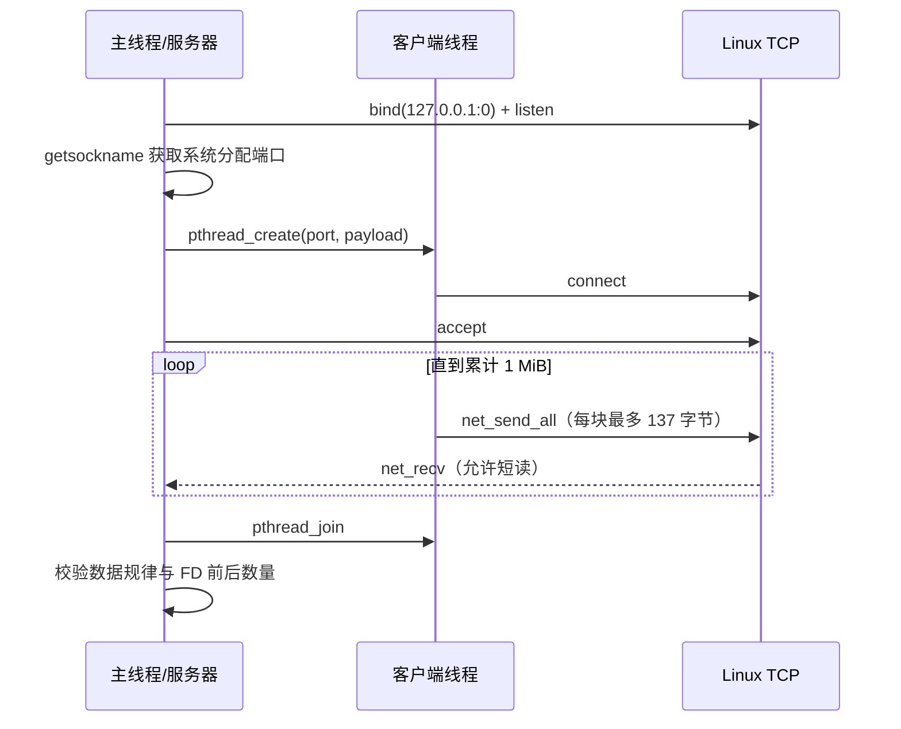

# D29 网络入口验收记录

## 1. 任务目标

D29 的目标是在 W04 工程基线之上建立 Gateway 网络入口，完成 TCP/UDP 基础实验、网络模块封装、异常路径验证、大消息与多连接测试，并为后续在 OK1126B-S 上运行 Gateway 做准备。

## 2. 网络数据流


压力测试中的线程与资源关系：



TCP 是字节流，不保存应用层的发送边界。因此客户端每次发送 137 字节，并不代表服务器每次 `recv()` 也返回 137 字节。服务器必须根据累计字节数循环接收。

## 3. 已实现内容

### 3.1 W04 工程基线迁移

- 有界阻塞队列与异步日志；
- SIGINT/SIGTERM 优雅退出；
- CMake 构建与 CTest 自动测试；
- `gateway --smoke` 自检入口。

### 3.2 网络模块

`modules/net/` 提供：

- IPv4 地址构造与 `sockaddr` 转换；
- TCP/UDP Socket 创建；
- `bind`、`listen`、`accept`、`connect`；
- 完整发送 `net_send_all`；
- TCP 接收 `net_recv`；
- UDP `sendto`/`recvfrom`。

`net_accept()` 会在被信号中断并返回 `EINTR` 时重试。

### 3.3 网络示例与异常路径

- TCP echo；
- UDP echo；
- 对端关闭与 SIGPIPE 场景；
- 未启动服务时连接失败；
- 端口被占用；
- UDP 接收超时；
- 非法 IPv4 地址。

### 3.4 大消息和多连接

`tests/net_stress_test.c` 当前覆盖：

- 100 次顺序 TCP 连接；
- 每次传输 1 MiB；
- 累计传输 100 MiB；
- 客户端以最多 137 字节分块发送；
- 服务器循环接收并统计短读；
- 使用确定性字节规律校验内容；
- 测试前后比较 `/proc/self/fd`，检查 FD 泄漏；
- CTest 超时保护，避免异常时永久阻塞。

## 4. 自动测试清单

| CTest 名称 | 覆盖内容 |
|---|---|
| `async_logger` | 异步日志基线 |
| `net_module` | 地址和 Socket 模块基础行为 |
| `gateway_smoke` | Gateway 回环 TCP 请求/响应及日志 |
| `graceful_shutdown_sigterm` | SIGTERM 优雅退出 |
| `graceful_shutdown_sigint` | SIGINT 优雅退出 |
| `net_tcp_echo` | TCP 正常路径 |
| `net_udp_echo` | UDP 正常路径 |
| `net_peer_close` | 对端关闭/SIGPIPE |
| `net_no_service` | 无服务连接失败 |
| `net_port_in_use` | 端口占用 |
| `net_udp_timeout` | UDP 超时 |
| `net_invalid_address` | 非法地址 |
| `net_stress` | 100 连接、100 MiB、短读、数据与 FD 校验 |

## 5. 复现命令

### 5.1 普通构建与测试

```bash
cmake -S . -B build -DCMAKE_BUILD_TYPE=Debug
cmake --build build -j
ctest --test-dir build --output-on-failure
```

### 5.2 只运行压力测试

```bash
ctest --test-dir build -R '^net_stress$' --output-on-failure
```

### 5.3 ASan 与 UBSan

```bash
cmake \
    -S . \
    -B build-sanitize \
    -DCMAKE_BUILD_TYPE=Debug \
    -DCMAKE_C_FLAGS="-fsanitize=address,undefined -fno-omit-frame-pointer -g" \
    -DCMAKE_EXE_LINKER_FLAGS="-fsanitize=address,undefined"

cmake --build build-sanitize -j

ASAN_OPTIONS=detect_leaks=1:halt_on_error=1 \
UBSAN_OPTIONS=halt_on_error=1:print_stacktrace=1 \
ctest --test-dir build-sanitize --output-on-failure
```

## 6. 当前验证证据

主机环境：WSL Ubuntu 22.04，GCC 11.4.0。

最近一次全量 ASan/UBSan 验证结果：

```text
100% tests passed, 0 tests failed out of 13
Total Test time (real) = 5.45 sec
```

最近一次压力测试关键结果：

```text
connections=100
payload_bytes=1048576
total_bytes=104857600
verification=PASS
open_fds_before=5
open_fds_after=5
```

`recv_calls` 与 `short_reads` 会因调度和 TCP 分段而变化，不应固定为某个具体数值。验收条件是测试成功、发生并正确处理短读、数据一致且 FD 前后相等。

## 7. D29 完成度

| 验收项 | 状态 | 说明 |
|---|---|---|
| W04 logger/graceful shutdown/CMake 迁移 | 已完成 | 已接入 Gateway 工程 |
| TCP/UDP 正常与异常实验 | 已完成 | 已注册 CTest |
| `modules/net` 封装并接入 CMake | 已完成 | Gateway 与测试复用 |
| `gateway --smoke` | 已完成 | 回环请求/响应与日志证据 |
| 1 MiB、100 连接与 FD 泄漏检查 | 已完成 | `net_stress` 通过 |
| 主机 ASan/UBSan 全量测试 | 已完成 | 13/13 通过 |
| OK1126B-S 板端压力测试 | 已完成 | 100 连接、100 MiB、数据与 FD 校验通过 |
| 主机↔OK1126B-S TCP 验证 | 已完成 | WSL 客户端连接板端并收到 echo |
| ARM64 Gateway 交叉构建 | 已完成 | Buildroot SDK、GCC 12.4.0、zlib 1.3.1 |
| 板端 `gateway --smoke` | 已完成 | 双向 TCP 请求/响应与异步日志通过 |
| 板端 SIGTERM 优雅退出 | 已完成 | 正常退出并完成日志排空 |
| Git 提交 | 已完成 | 使用 `git log -1 --oneline` 获取当前提交 |
| Notion 证据链接/实际工时/阻塞项 | 待完成 | Git 提交后填写 |

## 8. 下一步

1. 检查全部 Git 差异并创建 D29 提交；
2. 将提交哈希、文档路径、实际工时和阻塞项回填到 D29 任务；
3. 以 `docs/d29-ok1126b-board-evidence.md` 作为板端复现证据。
